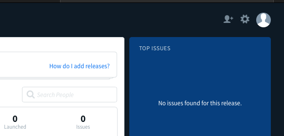
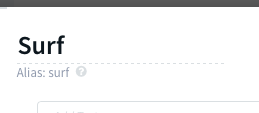

# DEPRECATED Подготовка проекта к выгрузке в Fabric

Неактуально. Использовать [firebase app distribution](firebase/app_distribution_migration.md)

1. Проект должен быть проинициализирован из актуального template.
2. Авторизоваться в [fabric](https://fabric.io) через рабочую почту.
3. Создать организацию для проекта или использовать уже существующую организацию. <br> 
Чтобы попасть в список организаций нажмите на иконку шестиренки на стрнице [fabric](https://fabric.io)<br>

4. В проекте зайти в app/src/main/AndroidManifest.xml и найти следующие строчки (если нет добавить самому)
```
<!-- todo Insert fabric key here
        <meta-data
            android:name="io.fabric.ApiKey"
            android:value="" /> -->
```
5. В fabric зайти в организацию скопировать поле **API Key** и вставить в **android:value=""** <br>

6. В пакете app создать файл fabric.properties с полем apiSecret. В это поле вставить значение из **Build Secret** организации (см. П5)<br>
Должно получиться следующее:<br>

7. Убедиться что в классе **App.kt** есть следующий код. И **initFabric** вызывается в методе **onCreate()**<br>
```
private fun initFabric() {
        Fabric.with(this, *getFabricKits())
    }

    private fun getFabricKits() =
            arrayOf(Crashlytics.Builder()
                    .core(CrashlyticsCore.Builder()
                            .disabled(BuildConfig.DEBUG)
                            .build())
                    .build())
```
8. Зайти в файл **buildTypes.gradle** и для всех необходимых **buildType** проставить **applicationIdSuffix** <br>
Должно выглядеть следующим образом:
```
 qa {
            signingConfig signingConfigs.test
            multiDexEnabled true
            minifyEnabled true
            debuggable = true
            proguardFiles getDefaultProguardFile('proguard-android.txt'), '../proguard-rules.pro'
            matchingFallbacks = ['release']
            ext.betaDistributionNotifications = true
      -> applicationIdSuffix config["qaVersionNameSuffix"]
        }
```
9. В студии выбрать необходимый **BuildType** с ним собрать и запустить приложение.<br>
На девайсе должно появиться приложение с **applicationId** - **ru.myapp.android.qa**, а в fabric c аналогичным id должен появиться проект. !Важно, приложение должно запускаться с активным интернетом.
10. Далее необходимо настроить **alias** на группу тестирования. Для этого на экране fabric зайти в BETA -> Manage Group.
11. Должно появиться окошко со списком доступных групп, если нет необходимой группы то добавить.<br>
12. Далее необходимо нажать на небходимую группу и убедиться, что в группе присутствуют разрешенные адреса тестеровщиков.
13. В этом же окошке находим поле Alias и копируем его.<br>

14. Зайти в файл **buildTypes.gradle** и для всех необходимых **buildType** проставить **ext.betaDistributionGroupAliases** <br>
    Должно выглядеть следующим образом:<br>
    ```
     qa {
                signingConfig signingConfigs.test
                multiDexEnabled true
                minifyEnabled true
                debuggable = true
                proguardFiles getDefaultProguardFile('proguard-android.txt'), '../proguard-rules.pro'
                matchingFallbacks = ['release']
          -> ext.betaDistributionGroupAliases = 'surf'
                ext.betaDistributionNotifications = true
                applicationIdSuffix config["qaVersionNameSuffix"]
            }
    ```
15. Убедиться что gradle task **crashlyticsUploadDistributionQa** выполняется успешно.

Если вы сделали всё верно, то в beta должна появиться ваша сборка для тестирования. 
Данная инструкция подходит и для других buildType.
